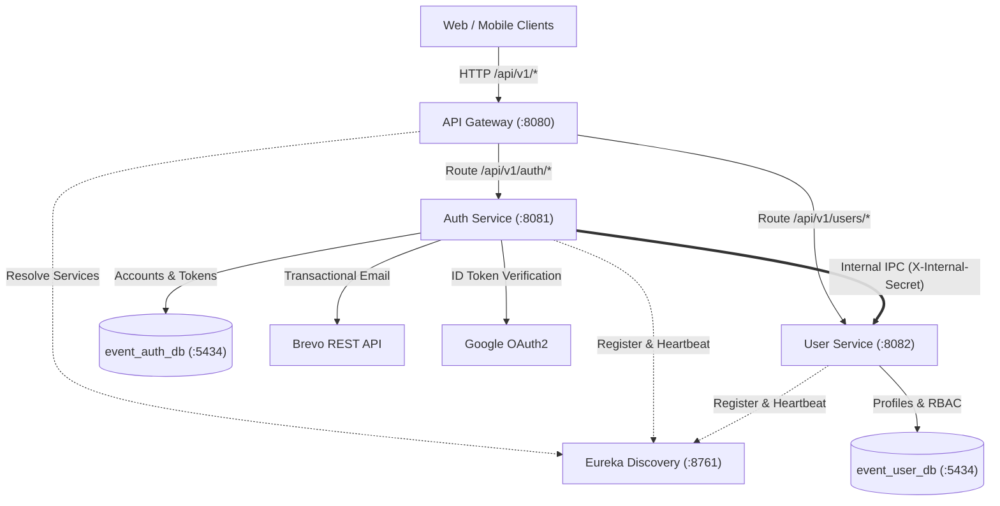

# Event & Festival Platform — Backend Microservices

[](https://openjdk.org/projects/jdk/21/)
[](https://spring.io/projects/spring-boot)
[](https://spring.io/projects/spring-cloud)
[](https://www.postgresql.org/)
[](LICENSE)

An enterprise-grade, event-driven backend microservices platform designed for festival management, ticket distribution, and attendee operations. Built on **Spring Boot 3**, **Spring Cloud**, and **PostgreSQL** with strict adherence to Clean Architecture, 12-Factor App principles, and stateless JWT security.

---

## 1. Key Capabilities

* **Centralized API Gateway**: Built with Spring Cloud Gateway for unified ingress, route aggregation, CORS filtering, and distributed request routing.
* **Service Registry & Discovery**: Powered by Netflix Eureka for dynamic instance registration, health checks, and client-side load balancing.
* **Stateless Dual-Token Authentication**: HMAC-SHA256 JWT access tokens paired with cryptographically secure, HttpOnly, SameSite refresh tokens and rotation.
* **Google OAuth2 Federation**: One-tap sign-in and account linking via Google ID Token verification.
* **Transactional Email Delivery**: Native Spring `RestClient` integration with Brevo API for transactional email verification and password resets.
* **Role-Based Access Control (RBAC)**: Fine-grained method-level security (`@PreAuthorize`) supporting 4 business roles: `ADMIN`, `ORGANIZER`, `ATTENDEE`, and `STAFF`.
* **Database-per-Service**: Independent PostgreSQL databases with versioned schema migrations managed by Flyway.
* **Consolidated API Documentation**: Aggregated OpenAPI 3 (Swagger UI) exposed directly through the API Gateway.

---

## 2. System Architecture



---

## 3. Services & Port Allocation

| Service | Port | Description | Database |
| :--- | :---: | :--- | :--- |
| **`discovery-service`** | `8761` | Netflix Eureka Service Registry & Health Dashboard | N/A |
| **`api-gateway`** | `8080` | Unified Edge Gateway & Centralized Swagger UI | N/A |
| **`auth-service`** | `8081` | Authentication, OAuth2, OTP verification, Token lifecycle | `event_auth_db` |
| **`user-service`** | `8082` | User profiles, Role & Permission management (RBAC) | `event_user_db` |
| **`common-base`** | Library | Shared DTOs (`ApiResponse`, `PageResponse`), Error codes, Global Exception Handlers | Shared Jar |

---

## 4. Tech Stack

* **Language & Runtime**: Java 21 (LTS)
* **Framework**: Spring Boot 3.3.4, Spring Cloud 2023.0.3 (Gateway, Eureka, OpenFeign)
* **Security**: Spring Security 6.3, JJWT (io.jsonwebtoken 0.12.6), BCrypt
* **Database & ORM**: PostgreSQL 16, Spring Data JPA / Hibernate 6.5, Flyway 10
* **External Integrations**: Brevo REST API, Google API Client (`google-api-client 2.6.0`)
* **Documentation**: Springdoc OpenAPI 2.6.0
* **Infrastructure**: Docker & Docker Compose

---

## 5. Getting Started

### Prerequisites
* **Java Development Kit (JDK)**: Version 21+
* **Apache Maven**: Version 3.9+
* **Docker & Docker Compose**: For PostgreSQL container

### 1. Clone & Setup Environment
```bash
git clone https://github.com/TruongHai-SE/event-platform-backend.git
cd event-platform-backend

# Copy environment template
cp .env.example .env
```
Fill in required credentials in `.env` (`BREVO_API_KEY`, `MAIL_FROM`, `GOOGLE_CLIENT_ID`, `TOKEN_SECRET_KEY`, `INTERNAL_API_SECRET`).

### 2. Start PostgreSQL Infrastructure
```bash
docker compose up -d
```
Verifies multi-database initialization (`event_auth_db` and `event_user_db`) on port `5434`.

### 3. Build & Run Tests
```bash
mvn clean test
```

### 4. Launch Services (Recommended Order)
1. **Discovery Service**: Run `DiscoveryServiceApplication` (`:8761`)
2. **API Gateway**: Run `ApiGatewayApplication` (`:8080`)
3. **Auth Service**: Run `AuthServiceApplication` (`:8081`)
4. **User Service**: Run `UserServiceApplication` (`:8082`)

---

## 6. API Documentation

Interactive API documentation and schema exploration are centralized at the API Gateway:

* **Swagger UI Portal**: [`http://localhost:8080/swagger-ui.html`](http://localhost:8080/swagger-ui.html)
* **Eureka Registry Dashboard**: [`http://localhost:8761`](http://localhost:8761)

Switch between `Auth Service` and `User Service` definitions from the top-right dropdown to inspect schemas, request payloads, and test endpoints directly with Bearer Token authorization.

---

## 7. Role-Based Access Control (RBAC)

The platform enforces four standard business roles:

| Role | Target Persona | Scope & Permissions |
| :--- | :--- | :--- |
| `ROLE_ADMIN` | System Administrator | Full access: user management, role assignments, system audit |
| `ROLE_ORGANIZER` | Event Organizer | Event creation, schedule planning, ticket tier management |
| `ROLE_ATTENDEE` | Ticket Buyer / Attendee | Default role upon registration; browse events, buy tickets |
| `ROLE_STAFF` | On-site Staff | Event browsing, QR check-in & ticket validation at gates |

*Unauthenticated visitors (Guests) access public endpoints via Gateway `permitAll()` without requiring database roles.*

---

## 8. License & Author

Developed by **[TruongHai-SE](https://github.com/TruongHai-SE)**.  
Licensed under the [MIT License](LICENSE).
